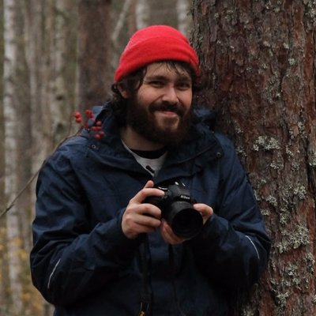

```{r, include=FALSE}
knitr::opts_chunk$set(
  results='asis', 
  echo = FALSE
)

library(glue)
library(tidyverse)

# Set this to true to have links turned into footnotes at the end of the document
PDF_EXPORT <- FALSE

# Holds all the links that were inserted for placement at the end
links <- c()

source('parsing_functions.R')

# Load csv with position info
position_data <- read_csv('positions.csv')
```


```{r}
# When in export mode the little dots are unaligned, so fix that. 
if(PDF_EXPORT){
  cat("
  <style>
  :root{
    --decorator-outer-offset-left: -6.5px;
  }
  </style>")
}
```


Aside
================================================================================


<!-- {width=100%} -->

```{r}
# When in export mode the little dots are unaligned, so fix that. 
if(PDF_EXPORT){
  cat("View this CV online with links at _francisko-rezende.github.io/cv/_")
} else {
  cat("[<i class='fas fa-download'></i> Download a PDF of this CV](https://github.com/francisko-rezende/cv/raw/master/index.pdf)")
}
```

Contact {#contact}
--------------------------------------------------------------------------------


- <i class="fa fa-envelope"></i> francisko.rezende@gmail.com
- <i class="fa fa-twitter"></i> francisko_r
- <i class="fa fa-github"></i> github.com/francisko-rezende
- <i class="fa fa-link"></i> [francisko-rezende.netlify.com](https://francisko-rezende.netlify.com/)
<!-- - <i class="fa fa-phone"></i> +358 44 925 1325 -->


Coding Skills {#coding_skills}
--------------------------------------------------------------------------------

```{r}
coding_skills <- tribble(
  ~skill,               ~level,
  "R",                  4,
  "LaTeX",              2,
  "Python",             1,
  "Bash",               1
)

build_skill_bars(coding_skills)
```


Language Skills {#language_skills}
--------------------------------------------------------------------------------

```{r}
language_skills <- tribble(
  ~skill,               ~level,
  "Portuguese",                  5,
  "English",             4,
  "Spanish",               2,
  "Finnish",              2
)

build_skill_bars(language_skills)
```


Disclaimer {#disclaimer}
--------------------------------------------------------------------------------

<!-- Made with the R package [**pagedown**](https://github.com/rstudio/pagedown). -->

This CV's source code is available at [github.com/francisko-rezende/cv](https://github.com/francisko-rezende/cv), it was derived from  [github.com/nstrayer/cv](https://github.com/nstrayer/cv).

I wrote it following [Nick Strayer's tutorial](https://livefreeordichotomize.com/2019/09/04/building_a_data_driven_cv_with_r/#want-to-build-your-cv-this-way).

Last updated on `r Sys.Date()`.


Main
================================================================================

Francisko _de Moraes Rezende_ {#title}
--------------------------------------------------------------------------------


```{r}
intro_text <- ""

cat(sanitize_links(intro_text))
```


Education {data-icon=graduation-cap data-concise=true}
--------------------------------------------------------------------------------

```{r}
print_section(position_data, 'education')
```


Research Experience {data-icon=laptop}
--------------------------------------------------------------------------------

::: aside
Being part of diverse research groups was a privilege. Cooperation is invaluable when it comes to  doingquality high science. 
:::

```{r}
print_section(position_data, 'research_positions')
```


Publications, Posters, and Talks {data-icon=book}
--------------------------------------------------------------------------------

::: aside
The presenter's name is _italicized_ for posters and talks
:::

```{r}
print_section(position_data, 'academic_articles')
```

Coding {data-icon=code}
--------------------------------------------------------------------------------

```{r, results = 'asis'}
position_data %>% print_section('coding')
```

Teaching Experience {data-icon=chalkboard-teacher}
--------------------------------------------------------------------------------

::: aside
I love being involved in education. I believe that teaching brings a whole new level of understanding to who teaches and empowers the students. 
:::

```{r}
print_section(position_data, 'teaching_positions')
```

Organizing comittee {data-icon=bezier-curve}
--------------------------------------------------------------------------------
::: aside
“Mostra de Trabalhos de Ecologia Básica” events were mini symposia in which Basic Ecology students were supposed to present the results of the small research projects that they conducted during the semester

"I Simpósio de Ecologia e Evolução" was an ecology and evolution symposium
:::

```{r, results = 'asis'}
position_data %>% print_section('organizing_committee')
```
<br>

Participation in scientific events {data-icon=calendar-check}
--------------------------------------------------------------------------------

```{r, results = 'asis'}
position_data %>% print_section('event_participation')
```


Specialization courses {data-icon=chalkboard}
--------------------------------------------------------------------------------

```{r, results = 'asis'}
position_data %>% print_section('specialization_courses')
```


<!-- Selected Writings {data-icon=chart-line} -->
<!-- -------------------------------------------------------------------------------- -->


<!-- ::: aside -->
<!-- I have [personal website](https://francisko-rezende.netlify.com/)  with a few posts where you can see some of my personal projects. -->
<!-- ::: -->

<!-- ```{r} -->
<!-- print_section(position_data, 'data_science_writings') -->
<!-- ``` -->


<!-- Selected Press (About)  {data-icon=newspaper} -->
<!-- -------------------------------------------------------------------------------- -->

<!-- ```{r} -->
<!-- print_section(position_data, 'about_me_press') -->
<!-- ``` -->


<!-- Selected Press (By)  {data-icon=newspaper} -->
<!-- -------------------------------------------------------------------------------- -->

<!-- ```{r} -->
<!-- print_section(position_data, 'by_me_press') -->
<!-- ``` -->


```{r}
if(PDF_EXPORT){
  cat("
  
Links {data-icon=link}
--------------------------------------------------------------------------------

<br>


")
  
  walk2(links, 1:length(links), function(link, index){
    print(glue('{index}. {link}'))
  })
}
```


